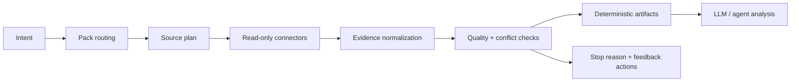

# Research Engine

> Evidence-first research infrastructure for AI agents.

[](https://www.python.org/)
[](LICENSE)
[](#roadmap)

Research Engine turns messy evidence from public pages, local exports, platform
bridges, APIs, and manual captures into auditable artifacts that an agent can
inspect before it writes an answer.

It is designed for the research step behind domain agents: market research,
investment memos, legal discovery, procurement intelligence, compliance review,
sales operations, support QA, code migration analysis, and any workflow where
"just search the web and summarize" is not enough.

## Why It Exists

Most agent research systems fail in predictable ways:

- they scrape first and ask what the evidence means later;
- they mix trusted sources, weak sources, duplicates, and contradictions in one
  context window;
- they lose the trail between the final answer and the raw evidence;
- they keep looping after there is no progress, or stop without saying why;
- they require one-off scripts for every new platform.

Research Engine treats research as a loop:



The output is not a hidden prompt. It is a run directory with evidence,
quality checks, loop records, and synthesis inputs that can be reviewed,
replayed, and improved.

## Quick Start

Requires Python 3.10 or newer.

```bash
# from a local checkout
python -m pip install -e '.[dev]'
```

For optional visible, user-consented login recovery:

```bash
python -m pip install -e '.[browser]'
playwright install chromium
research-engine doctor browser
```

If login is required, Research Engine hands the dedicated site profile to normal
installed Chrome. Complete SSO/MFA/CAPTCHA, return to the Research Engine tab,
click **Close window and verify sign-in**, and the guarded Playwright capture resumes.
Chrome closes briefly during verification. If the site still shows a login wall,
the same login window reopens automatically, up to three attempts within the
five-minute login budget.
Set `RESEARCH_ENGINE_LOGIN_BROWSER` only when Chrome is installed in a nonstandard
location.

For the simplest flow, run the interactive wizard:

```bash
research
research "research DRAM HBM supply shortage"
```

The wizard asks for topic, depth, source scope, optional JSONL evidence exports,
and final confirmation. It is read-only by design: no posting, messaging,
trading, uploading, account mutation, or credential collection.

For scripted runs:

```bash
research-engine run "research AI coding agents" --pack auto --output runs
research-engine run "research DRAM HBM supply shortage" --pack auto --depth deep --output runs
research-engine run "research Lenny memory discussion" --external-evidence exports/lenny.jsonl --output runs
research-engine run "LinkedIn agent engineering evidence" --browser-auth auto --output runs
research-engine run "strict public-only research" --browser-auth never --output runs
```

Deep and audit `job_market` runs schedule LinkedIn as an authenticated discovery
source even when it is not named in the topic. Official company careers pages and
ATS listings remain the source of truth for active-opening counts. If a scheduled
LinkedIn pass cannot run in a noninteractive session, the run continues with a
recorded coverage gap and review-required confidence; explicitly requested
LinkedIn research remains a blocking human gate.

Unseeded CLI runs use anonymous AnySearch discovery by default. Query text crosses
that third-party boundary, which is recorded in `query_plan.json`. Opt out with
`--search-provider none`, or use an explicit SearXNG instance with
`--search-provider searxng --search-endpoint https://search.example.org/search`.

M2 profile examples:

```bash
# technical comparison with per-project GitHub facets
research-engine run "vLLM versus SGLang inference engines" --pack technical --depth deep

# explicit point-in-time market scope
research-engine run "AI inference market landscape" --pack market_landscape \
  --scope-file scopes/inference-market.json --as-of 2026-07-16

# scoped point-in-time job snapshot; quantitative counts require the scope file
research-engine run "AI engineer job market" --pack job_market \
  --scope-file scopes/ai-engineer-jobs.json --as-of 2026-07-16
```

See [M2 usage and scope contracts](docs/m2-usage.md) for complete scope examples,
freshness semantics, and repair limits.

For current job-description and interview evidence, use the complete structured target tuple. See [Structured target intelligence](docs/target-intelligence.md) for the evidence and consumer contract.

```bash
research-engine run "Stripe Staff Backend Engineer US" --pack interview_prep \
  --target-company Stripe --target-role-family software_engineering \
  --target-role-title "Staff Backend Engineer" --target-level staff \
  --target-geography US --output runs
```

Check optional local capabilities:

```bash
research-engine doctor
research-engine doctor agentreach
research-engine doctor opencli --format json
research-engine doctor browser
```

Run tests:

```bash
make check
make eval  # deterministic offline regression scorecard
```

## Codex Skill

This repo includes an optional Codex Skill for natural-language research
requests. Install it into your local Codex skills directory:

```bash
mkdir -p ~/.codex/skills
cp -R skills/research-engine ~/.codex/skills/
```

After installing, prompts such as `research AI infra jobs` or `调研一下 HBM
供应链` route directly through the Research Engine workflow. The skill infers
scope and source mix from the request and defaults to balanced deep research.
It asks a follow-up only when a missing choice would materially change the
result or explicit authorization is required.

## What You Get

Each run writes a traceable artifact bundle:

```text
runs/<timestamp-or-topic>/
├── run_manifest.json
├── query_plan.json
├── collection_execution.json
├── cost_record.json
├── evidence.jsonl
├── chunks.jsonl
├── evidence_quality.json
├── facet_coverage.json
├── repair_record.json
├── auth_challenges.jsonl
├── claim_review.json
├── supply_demand_matrix.json
├── decision_brief.json
├── loop_contract.json
├── loop_record.json
├── research_report.md
├── research_report.pdf
└── pdf_report_status.json
```

Rerunning the same topic on the same day creates a suffixed directory such as
`<date>-<topic>--02`; an existing run bundle is never overwritten. Scripted
`run` invocations also append a redacted record to `runs/journal.jsonl`.
Imported evidence receives a unique run-scoped `evidence_id`, while its
original identifier remains available as `source_evidence_id`.

Every terminal run attempts the PDF export, including dry runs and partial or
warning outcomes. PDF failure is non-fatal and is disclosed in
`pdf_report_status.json`, `run_manifest.json`, and CLI output.

Important files:

- `evidence.jsonl` is the normalized parent-source trace; claims may cite it directly
  or cite stable child IDs in `chunks.jsonl`.
- `evidence_quality.json` records source tiers, duplicate pressure, and
  independent conflict flags; quality and topical relevance remain separate.
- `facet_coverage.json` records relevant, claim-eligible yield plus required facets
  omitted by the selected query budget.
- `chunks.jsonl` preserves stable parent-linked chunks and extracted table provenance;
  chunk rows participate in relevance, deduplication, conflicts, and synthesis.
- `repair_record.json` explains the optional single pass-2 repair and its stop reason.
- `auth_challenges.jsonl` records consent/login recovery status without browser secrets.
- `collection_execution.json` records connector status, retries, warnings,
  cache hits, and row counts.
- `cost_record.json` records the paid-call budget, attempts, available usage,
  and stop reason without persisting credentials.
- `loop_contract.json` defines the research loop: goal, source scope, checks,
  feedback rules, records, stop conditions, and human gates.
- `loop_record.json` records what passed, warned, failed, or stopped the run.

## Core Ideas

### Pack-driven research

Research packs are JSON profiles for a domain or topic. A pack can define:

- `match_terms` for automatic routing;
- `query_templates` for collection planning;
- `finance_tickers`, seed `web_pages`, or custom `sources`;
- `claim_specs` and `matrix_nodes` for deterministic synthesis;
- `decision_rules` for stance summaries and action-bias labels.

Use `--pack auto` to route by topic, or `--pack <id>` to force a pack.

### Source-agnostic connectors

Connectors implement a small `collect(CollectionRequest) -> CollectionResult`
contract. The core runner does not care whether evidence came from a public web
page, a finance quote endpoint, a GitHub search, a logged-in browser export, or
an upstream CLI bridge.

Built-in connectors include:

| Connector | Purpose |
| --- | --- |
| `manual` | Pack-provided or hand-authored evidence rows |
| `external_jsonl` | Authorized exports from logged-in tools or private collectors |
| `web_page` | Static public page fetches from explicit seed URLs |
| `web_search` | AnySearch or explicit SearXNG discovery; snippets are never claim evidence |
| `finance_quote` | Public quote snapshots for configured tickers |
| `github_public_search` | Public GitHub repository search fallback |
| `official_job_discovery` | Scoped official ATS/company-career discovery |
| `agent_reach_bridge` | Optional AgentReach/upstream CLI bridge output |
| `opencli_bridge` | Optional OpenCLI read-only adapter output |
| `authenticated_browser` | Optional visible Playwright recovery after per-site consent |

See [docs/connector-support.md](docs/connector-support.md) for the current
support matrix and planned connectors.

### Loop-first execution

Research Engine borrows from loop-engineering practice:

- keep context clean by offloading raw evidence to files;
- use a small, focused tool surface instead of an unbounded tool pile;
- separate maker and checker steps;
- stop for explicit reasons: no sources, no rows, failed checks, max iterations,
  timeout, or human gate.

Downstream agents should gate on `loop_status` and `stop_reason`, not just the
top-level run status.

## How It Compares

Research Engine is not trying to replace crawlers, browsers, or platform CLIs.
It is the orchestration and evidence layer that makes those tools useful inside
agent workflows.

| Tool type | Good at | Research Engine's role |
| --- | --- | --- |
| Web crawlers | Fetching pages at scale | Normalize, score, de-duplicate, and synthesize evidence |
| Browser automation | Logged-in or dynamic workflows | Run bounded user-consented recipes or import authorized JSONL captures |
| AgentReach-style CLIs | Exposing platform-specific tools | Treat CLI output as connector evidence |
| OpenCLI-style adapters | Turning websites into commands | Run allowlisted read-only adapters behind the same contract |
| LLM agents | Reasoning and writing | Consume auditable artifacts after checks run |

## External Evidence

Use JSONL when evidence comes from a logged-in browser session, paid source, or
proprietary collector:

```json
{"title":"Source title","url":"https://example.com","text":"Visible evidence text","metadata":{"platform":"lenny"}}
```

Then run:

```bash
research-engine run "research Lenny memory discussion" \
  --external-evidence exports/lenny.jsonl \
  --output runs
```

For the supported recipe batch, Research Engine opens a dedicated profile after
showing an exact-origin consent screen. Normal Chrome handles user-controlled
login, SSO, MFA, and CAPTCHA; Playwright is closed during login and resumes only
for guarded read-only capture. The engine never asks for credentials or copies
browser cookies/storage into artifacts. It does not bypass robots denial,
paywalls, rate limits, or entitlements. Artifact references store
evidence filenames and stable path hashes rather than full local paths. Token-like
fields, authorization headers, cookie values, and command payloads are sanitized
before artifacts are written.

The first fixture-verified recipes cover LinkedIn, X, Reddit, Blind, Glassdoor,
Indeed, 一亩三分地, Hacker News, GitHub, and Stack Overflow. YouTube remains
caption/transcript-first through `yt-dlp` for fast text retrieval.

Consent and dedicated profiles can be managed without exposing their contents:

```bash
research-engine auth list
research-engine auth revoke linkedin
research-engine auth clear-profile linkedin
```

## Minimal Connector Example

```python
from research_engine.models import CollectionResult


class MyConnector:
    connector_id = "my_source"

    def collect(self, request):
        return CollectionResult(
            source_id=request.source_id,
            connector=self.connector_id,
            rows=[
                {
                    "title": "Example",
                    "url": "https://example.com",
                    "text": "Evidence text visible to the collector.",
                }
            ],
        )
```

Additional integrations should live behind this connector interface so the core
runner remains source-agnostic.

## Current Limits

Research Engine is alpha software.

- Web discovery is bounded search plus canonical refetch, not a broad crawler.
- Search snippets are discovery-only; only valid canonical refetches can support claims.
- PDF extraction uses an allowlisted local `pdftotext` when available and otherwise
  records an explicit invalid reason.
- Optional bridge connectors depend on local tools being installed and configured.
- Unsupported logged-in or paid sources still require authorized exports; raw
  credentials are never accepted.
- Quality scoring is deterministic and inspectable, but still early.
- The engine prepares evidence for analysis; it does not replace expert judgment.

## Development

```bash
python -m pip install -e '.[dev]'
make check
```

Useful commands:

```bash
research-engine run "research AI coding agents" --pack auto --dry-run --output runs
research-engine doctor --format json
python -m pytest -q
python -m ruff check src tests
```

## Roadmap

- Bounded crawler connector with sitemap support and optional Playwright rendering.
- More first-party packs for finance, legal, procurement, compliance, sales,
  support QA, and code migration research.
- Stronger source registries, citation graph checks, and pack-specific
  contradiction rules.
- Richer repair strategies beyond the single bounded pass-2 rule.
- Persistent loop memory for repeated research programs.
- More connector bridges for authorized platform exports.
- Public examples and benchmark tasks for evidence quality and synthesis quality.

## Contributing

Contributions are welcome while the project is early. Good first areas:

- new connector implementations;
- research pack examples;
- source quality heuristics;
- artifact schema improvements;
- tests around safety, redaction, and loop stopping behavior.

Please keep connectors read-only by default and make source limitations explicit.

## License

MIT. See [LICENSE](LICENSE).
