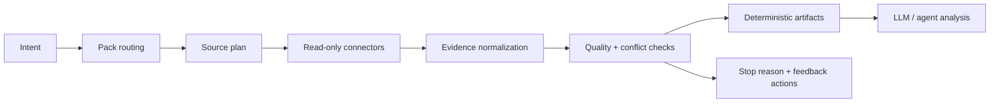

# Research Engine

> Evidence-first research infrastructure for AI agents.

[](https://www.python.org/)
[](LICENSE)
[](#roadmap)

Research Engine turns messy evidence from public pages, local exports, platform
bridges, APIs, and manual captures into auditable artifacts that an agent can
inspect before it writes an answer.

It is designed for the research step behind domain agents: market research,
investment memos, legal discovery, procurement intelligence, compliance review,
sales operations, support QA, code migration analysis, and any workflow where
"just search the web and summarize" is not enough.

## Why It Exists

Most agent research systems fail in predictable ways:

- they scrape first and ask what the evidence means later;
- they mix trusted sources, weak sources, duplicates, and contradictions in one
  context window;
- they lose the trail between the final answer and the raw evidence;
- they keep looping after there is no progress, or stop without saying why;
- they require one-off scripts for every new platform.

Research Engine treats research as a loop:



The output is not a hidden prompt. It is a run directory with evidence,
quality checks, loop records, and synthesis inputs that can be reviewed,
replayed, and improved.

## Quick Start

Requires Python 3.10 or newer.

```bash
# from a local checkout
python -m pip install -e '.[dev]'
```

For the simplest flow, run the interactive wizard:

```bash
research
research "research DRAM HBM supply shortage"
```

The wizard asks for topic, depth, source scope, optional JSONL evidence exports,
and final confirmation. It is read-only by design: no posting, messaging,
trading, uploading, account mutation, or credential collection.

For scripted runs:

```bash
research-engine run "research AI coding agents" --pack auto --output runs
research-engine run "research DRAM HBM supply shortage" --pack auto --depth deep --output runs
research-engine run "research Lenny memory discussion" --external-evidence exports/lenny.jsonl --output runs
```

For current job-description and interview evidence, use the complete structured target tuple. See [Structured target intelligence](docs/target-intelligence.md) for the evidence and consumer contract.

```bash
research-engine run "Stripe Staff Backend Engineer US" --pack interview_prep \
  --target-company Stripe --target-role-family software_engineering \
  --target-role-title "Staff Backend Engineer" --target-level staff \
  --target-geography US --output runs
```

### Cost-safe target discovery

Official Careers and ATS sources always run first. Add `--anysearch-discovery`
to use AnySearch only when the official result is insufficient. AnySearch is a
hosted discovery service; the connector uses its JSON-RPC/MCP endpoint directly
and treats every returned URL as `discovery_only` until Research Engine
re-fetches and validates it.

```bash
research-engine run "Stripe Staff Backend Engineer US" --pack interview_prep \
  --target-company Stripe --target-role-family software_engineering \
  --target-role-title "Staff Backend Engineer" --target-level staff \
  --target-geography US --anysearch-discovery \
  --cache-dir .cache/target-discovery --output runs
```

`ANYSEARCH_API_KEY` is optional. Candidate resumes, names, stories, and scores
are never sent to AnySearch. Target discovery cache entries expire after 24
hours, so the same target can reuse results without keeping stale job evidence
indefinitely.

xAI discovery is off by default. A key alone cannot enable it. The last-resort
path requires both an explicit flag and a positive per-run budget:

```bash
research-engine run "Stripe Staff Backend Engineer US" --pack interview_prep \
  --target-company Stripe --target-role-family software_engineering \
  --target-role-title "Staff Backend Engineer" --target-level staff \
  --target-geography US --paid-discovery --paid-call-budget 1 \
  --cache-dir .cache/target-discovery --output runs
```

Paid connectors make one attempt and never retry or fall back to a second
endpoint. Every run writes `cost_record.json`; missing provider usage is stored
as unknown rather than zero. Set `RESEARCH_ENGINE_EXTERNAL_CALLS_DISABLED=1`
to stop AnySearch and paid discovery at their transport boundaries. Pytest
blocks real transports and requires injected fakes.

Check optional local capabilities:

```bash
research-engine doctor
research-engine doctor agentreach
research-engine doctor opencli --format json
```

Run tests:

```bash
make check
```

## Codex Skill

This repo includes an optional Codex Skill for natural-language research
requests. Install it into your local Codex skills directory:

```bash
mkdir -p ~/.codex/skills
cp -R skills/research-engine ~/.codex/skills/
```

After installing, prompts such as `research AI infra jobs` or `调研一下 HBM
供应链` route directly through the Research Engine workflow. The skill infers
scope and source mix from the request and defaults to balanced deep research.
It asks a follow-up only when a missing choice would materially change the
result or explicit authorization is required.

## What You Get

Each run writes a traceable artifact bundle:

```text
runs/<timestamp-or-topic>/
├── run_manifest.json
├── query_plan.json
├── collection_execution.json
├── cost_record.json
├── evidence.jsonl
├── evidence_quality.json
├── claim_review.json
├── supply_demand_matrix.json
├── decision_brief.json
├── loop_contract.json
├── loop_record.json
└── research_report.md
```

Important files:

- `evidence.jsonl` is the normalized source trace an LLM should cite from.
- `evidence_quality.json` records source tiers, duplicate pressure, and
  directional conflict flags.
- `collection_execution.json` records connector status, retries, warnings,
  cache hits, and row counts.
- `cost_record.json` records the paid-call budget, attempts, available usage,
  and stop reason without persisting credentials.
- `loop_contract.json` defines the research loop: goal, source scope, checks,
  feedback rules, records, stop conditions, and human gates.
- `loop_record.json` records what passed, warned, failed, or stopped the run.

## Core Ideas

### Pack-driven research

Research packs are JSON profiles for a domain or topic. A pack can define:

- `match_terms` for automatic routing;
- `query_templates` for collection planning;
- `finance_tickers`, seed `web_pages`, or custom `sources`;
- `claim_specs` and `matrix_nodes` for deterministic synthesis;
- `decision_rules` for stance summaries and action-bias labels.

Use `--pack auto` to route by topic, or `--pack <id>` to force a pack.

### Source-agnostic connectors

Connectors implement a small `collect(CollectionRequest) -> CollectionResult`
contract. The core runner does not care whether evidence came from a public web
page, a finance quote endpoint, a GitHub search, a logged-in browser export, or
an upstream CLI bridge.

Built-in connectors include:

| Connector | Purpose |
| --- | --- |
| `manual` | Pack-provided or hand-authored evidence rows |
| `external_jsonl` | Authorized exports from logged-in tools or private collectors |
| `web_page` | Static public page fetches from explicit seed URLs |
| `official_job_discovery` | Target-ranked official ATS/company-careers discovery and final verification |
| `xai_discovery` | Optional xAI Web/X citation discovery; citations remain discovery-only until re-fetched |
| `finance_quote` | Public quote snapshots for configured tickers |
| `github_public_search` | Public GitHub repository search fallback |
| `agent_reach_bridge` | Optional AgentReach/upstream CLI bridge output |
| `opencli_bridge` | Optional OpenCLI read-only adapter output |

See [docs/connector-support.md](docs/connector-support.md) for the current
support matrix and planned connectors.

### Loop-first execution

Research Engine borrows from loop-engineering practice:

- keep context clean by offloading raw evidence to files;
- use a small, focused tool surface instead of an unbounded tool pile;
- separate maker and checker steps;
- stop for explicit reasons: no sources, no rows, failed checks, max iterations,
  timeout, or human gate.

Downstream agents should gate on `loop_status` and `stop_reason`, not just the
top-level run status.

## How It Compares

Research Engine is not trying to replace crawlers, browsers, or platform CLIs.
It is the orchestration and evidence layer that makes those tools useful inside
agent workflows.

| Tool type | Good at | Research Engine's role |
| --- | --- | --- |
| Web crawlers | Fetching pages at scale | Normalize, score, de-duplicate, and synthesize evidence |
| Browser automation | Logged-in or dynamic workflows | Import authorized read-only captures as JSONL |
| AgentReach-style CLIs | Exposing platform-specific tools | Treat CLI output as connector evidence |
| OpenCLI-style adapters | Turning websites into commands | Run allowlisted read-only adapters behind the same contract |
| LLM agents | Reasoning and writing | Consume auditable artifacts after checks run |

## External Evidence

Use JSONL when evidence comes from a logged-in browser session, paid source, or
proprietary collector:

```json
{"title":"Source title","url":"https://example.com","text":"Visible evidence text","metadata":{"platform":"lenny"}}
```

Then run:

```bash
research-engine run "research Lenny memory discussion" \
  --external-evidence exports/lenny.jsonl \
  --output runs
```

Research Engine does not read browser cookies, bypass login walls, scrape around
paywalls, or ask for passwords/API keys in prompts. Artifact references store
evidence filenames and stable path hashes rather than full local paths. Token-like
fields, authorization headers, cookie values, and command payloads are sanitized
before artifacts are written.

## Minimal Connector Example

```python
from research_engine.models import CollectionResult


class MyConnector:
    connector_id = "my_source"

    def collect(self, request):
        return CollectionResult(
            source_id=request.source_id,
            connector=self.connector_id,
            rows=[
                {
                    "title": "Example",
                    "url": "https://example.com",
                    "text": "Evidence text visible to the collector.",
                }
            ],
        )
```

Additional integrations should live behind this connector interface so the core
runner remains source-agnostic.

## Current Limits

Research Engine is alpha software.

- Built-in web collection fetches explicit public pages; it is not yet a broad
  crawler.
- Optional bridge connectors depend on local tools being installed and configured.
- Logged-in or paid sources must be provided as authorized exports, not raw
  credentials.
- Quality scoring is deterministic and inspectable, but still early.
- The engine prepares evidence for analysis; it does not replace expert judgment.

## Development

```bash
python -m pip install -e '.[dev]'
make check
```

Useful commands:

```bash
research-engine run "research AI coding agents" --pack auto --dry-run --output runs
research-engine doctor --format json
python -m pytest -q
python -m ruff check src tests
```

## Roadmap

- Bounded crawler connector with sitemap support and optional Playwright rendering.
- More first-party packs for finance, legal, procurement, compliance, sales,
  support QA, and code migration research.
- Stronger source registries, citation graph checks, and pack-specific
  contradiction rules.
- Repair passes that can revise a source plan when coverage is weak.
- Persistent loop memory for repeated research programs.
- More connector bridges for authorized platform exports.
- Public examples and benchmark tasks for evidence quality and synthesis quality.

## Contributing

Contributions are welcome while the project is early. Good first areas:

- new connector implementations;
- research pack examples;
- source quality heuristics;
- artifact schema improvements;
- tests around safety, redaction, and loop stopping behavior.

Please keep connectors read-only by default and make source limitations explicit.

## License

MIT. See [LICENSE](LICENSE).
